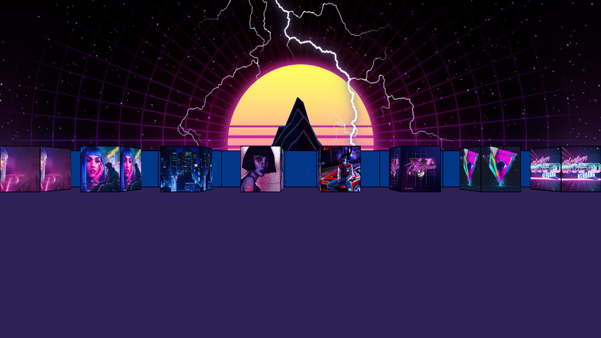

# 

# Wolf3D
Made in two weeks during **_september 2019_**. This project was about recreating the old game _Wolfenstein3D_. It used a raycasting algorithm and was made entirely in C<br /><br />

## Installation

### Unix operating systems
You first need to have sdl2 installed locally.<br />
- Linux
```
$ apt-get install sdl2
```
- Mac
```
$ brew install sdl2
```
Then run `make` inside the repo.
```
$ make path/to/repo
```
### Windows and other operating systems
Not implemented.<br />

## Usage

### Launching the programm
The programm takes a map written in a custom format (`.wolf`) as an argument. Some [maps](maps/) are directly available in the corresponding directory.<br />
```
$ ./wolf3d maps/sample.wolf
```

### Keybinds
Once the programm is running, you can move with `W A S D` and rotate the camera by moving your `mouse`. You can also use  `arrows` in a similar way as in the original game. You can toggle multiple settings: `Tab` to show the cursor, `F` to toggle fullscreen, `Shift` to sprint, `T` to disable wall delimitations, and `G` to disable the skybox. Press `ESC` or close the window to quit the programm.<br />
